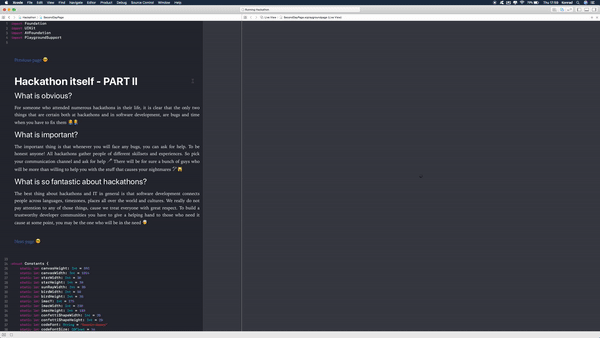

# Hackathon Playground

Hackathon Playground is my WWDC 2018 Scholarship app.  The main theme of the app are hackathons in general. The aim of this project was to create a playground that would tell a compelling story and showcase some of the functionalities that Swift Playgrounds provide to Apple Developers, in terms of useful ways of presenting their projects to others.

### Frameworks used

- UIKit

- AVFoundation

- Foundation

### Screenshots

### Video

